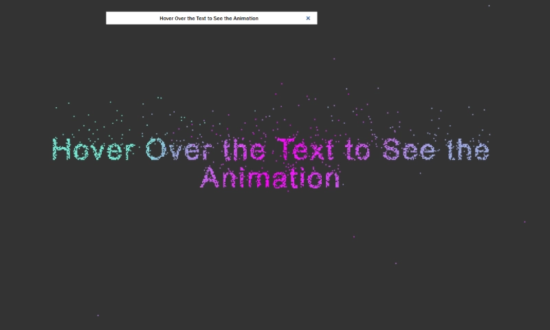

# Particle Text

An interactive **particle-based text animation** built using the HTML Canvas API.  
Particles form dynamic text and respond to mouse movement with different animation effects.
Particle text using HTML Canvas. This is a tutorial project by **Frank's Laboratory**.

## 🌐 Live Demo

[https://chesteralejandro.github.io/frontend-project-gallery/tutorial-projects/particle-text/](https://chesteralejandro.github.io/frontend-project-gallery/tutorial-projects/particle-text/)

## 🛠️ Tech Stack

- HTML5 Canvas API
- CSS
- Vanilla JavaScript (ES Modules)

## 📷 Screenshot

## 📌 Notes

This project is part of my **Frontend Project Gallery**, where I document and improve small UI/interaction experiments.
